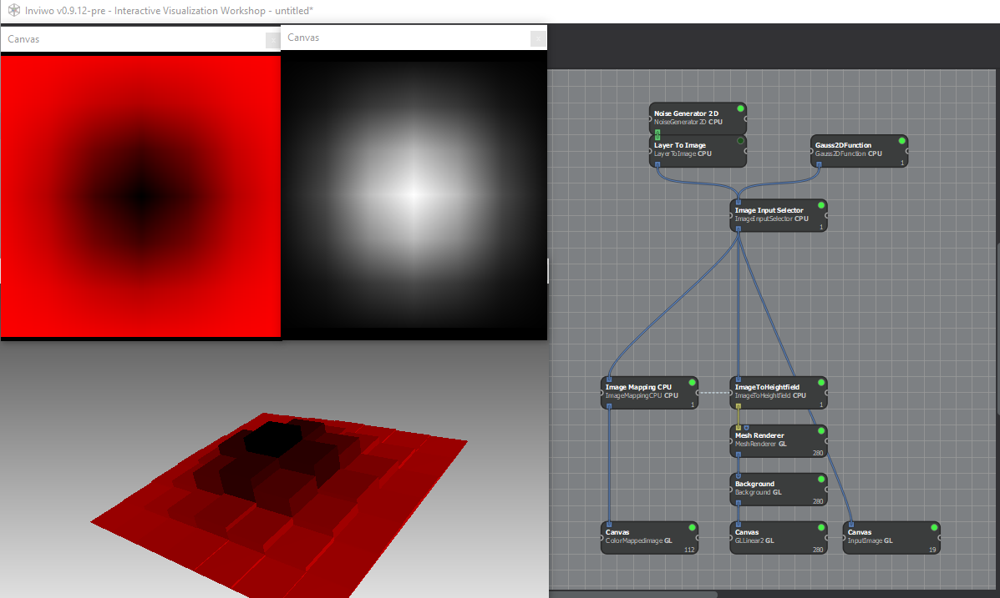
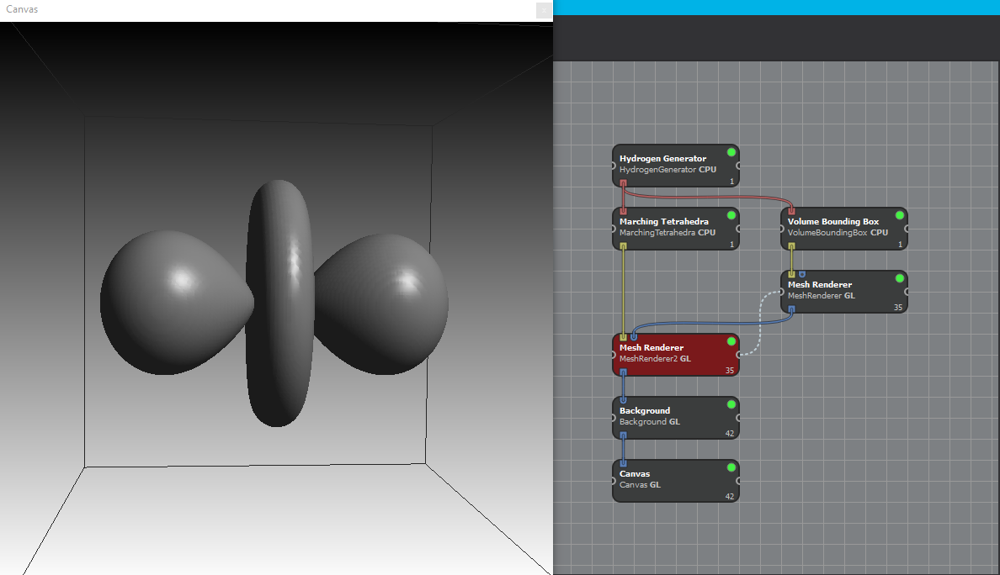
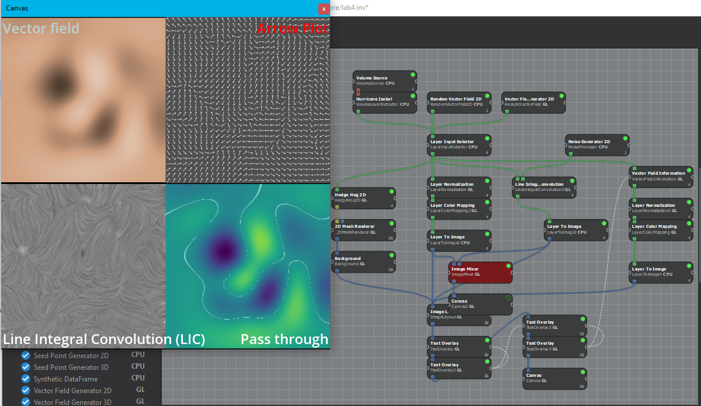

# Scientific Visualization Labs

This repository contains lab assignments completed as part of the **Scientific Visualization** course. These labs focus on implementing and experimenting with different visualization techniques to process and display scientific data effectively.

## Labs Overview

- **Lab 1: Basic Volume Rendering**
  - Implemented basic volume rendering techniques to visualize scalar fields using raycasting.
  - 

- **Lab 2: Isosurface Extraction with Marching Cubes**
  - Extracted isosurfaces from volumetric data using the Marching Cubes algorithm.

- **Lab 3: Vector Field Visualization**
  - Visualized vector fields using streamlines and glyphs to represent flow patterns.
  - 

- **Lab 4: Line Integral Convolution (LIC)**
  - Implemented LIC to generate dense visualizations of 2D vector fields.
  - 

## Technologies Used

- **C++ / GLSL**: For rendering and shader programming.
- **Inviwo**: A visual analytics framework used to develop and test visualization techniques.

